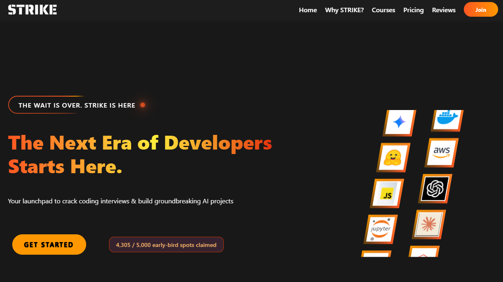
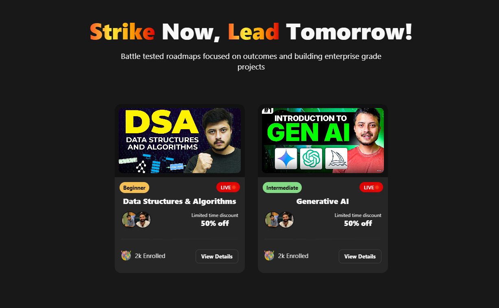

# STRIKE - Coder Army CSS Hackathon 2025 

A modern, visually stunning landing page for STRIKE, a premium paid course platform featuring DSA, Generative AI, and interview-focused programs.Built using HTML and CSS, this single-page website delivers an engaging user experience through immersive animations and a sleek, responsive design.



##   Live Demo

**[View Live Website](#)** *https://strike-css-hackathon-sambhav.netlify.app/*

---
## 📂 Project Structure

```
strike-landing-page/
│
├── index.html              # Main HTML file
├── style.css               # Complete stylesheet
├── assets/
│   ├── STRIKE.png          # Logo
│   ├── favicon.png         # Favicon
│   ├── tech-images/        # Technology logos
│   ├── course-images/      # Course thumbnails
│   ├── review-avatar-icons/# User avatars
│   └── footer-logos/       # Social media icons
└── README.md               # Documentation
```
---

## 🎯 Sections Overview

1. **Navbar** - Fixed header with blur effect
2. **Hero** - Eye-catching intro with animated call-to-action
3. **Stats** - Key metrics with gradient numbers
4. **Courses** - Flippable course cards
5. **Why STRIKE** - Feature highlight grid
6. **Instructors** - Instructor profiles with auto-carousel
7. **Reviews** - Student testimonials in bento layout
8. **Pricing** - Course pricing with ribbon discount badges
9. **Contact** - Animated contact form
10. **FAQ** - Accordion-style questions
11. **Footer** - Links and social media

---

##  Key Features

###  Visual Design
- **Glassmorphism UI** - Modern frosted glass effects with backdrop blur
- **Gradient Accents** - Dynamic orange, amber, red, and yellow color palette
- **Responsive Layout** - Fully optimized for desktop, tablet, and mobile devices

###  Advanced Animations

#### Hero Section
- **Animated Border Beam** - Rotating conic gradient around the "STRIKE is Here" tag
- **Pulsing Dot Indicator** - Live status animation with glowing effects
- **Typewriter Effect** - Dynamic text reveal animation
- **Spiderverse Glitch Button** - Multi-layer glitch effect on hover with:
  - Layered text displacement
  - RGB color separation
  - Noise texture overlay
  - Animated slice effects

#### Tech Stack Showcase
- **Infinite Conveyor Belts** - Dual-direction scrolling logo animations
- **Smooth Loop** - Seamless infinite scroll using duplicated content groups

#### Course Cards
- **3D Flip Animation** - Card flips to reveal additional details on hover
- **Hover Transitions** - Smooth transform and shadow effects

#### Feature Cards
- **Animated Border Flow** - Gradient border animation on hover
- **Glassmorphism Backdrop** - Translucent cards with blur effects

#### Instructor Carousel
- **Auto-Sliding Cards** - Automatic carousel rotation
- **Spinning Border** - Circular rotating gradient around profile photos
- **Quote Box** - Stylized testimonial containers with decorative quotation marks

#### Reviews Section
- **Bento Grid Layout** - Asymmetric card arrangement with varying sizes
- **Mountain Graphic** - Glowing drop-shadow effect on hover
- **Horizontal Scroll** - Touch-friendly swipe navigation on mobile

###  Responsive Design

#### Desktop (1200px+)
- Full navigation menu
- Multi-column layouts
- Hover-based interactions

#### Tablet (769px - 1024px)
- Adjusted grid layouts
- Collapsed conveyor belts
- Optimized spacing

#### Mobile (≤768px)
- Hamburger menu navigation
- Single-column layouts
- Horizontal scroll for reviews
- Touch-optimized course card swiping
- Hidden instructor animations for performance

---

## 🛠️ Technologies Used

- **HTML5** - Semantic markup
- **CSS3** - Advanced styling with:
  - CSS Grid & Flexbox
  - CSS Variables
  - Backdrop Filters
  - CSS Animations & Keyframes
  - Scroll Snap
  - Clip Path
  - Linear & Conic Gradients

---


##  Getting Started

1. Clone or download the repository.

2. Open `index.html` in a web browser to view the landing page.

---

##  Screenshots





##  Acknowledgments

- Lottie animations from [LottieFiles](https://lottiefiles.com)
- Inspired by modern web design trends
- Technology logos belong to their respective owners

---

**Made with ❤️ and lots of CSS animations**
